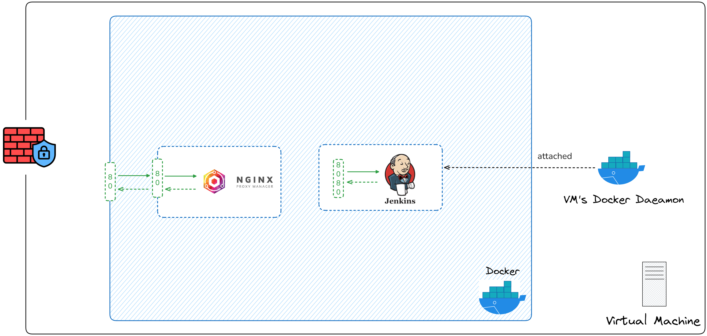
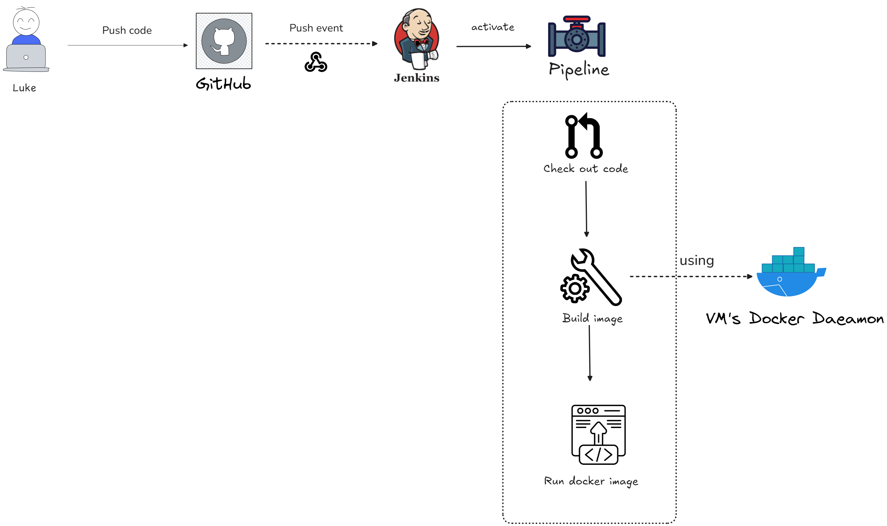

# E-Commerce Product Management Tool – Implementation Overview

**API Url:** https://api-ecommerce.codebyluke.io.vn/swagger
**FE Url:** https://ecommerce-badminton.codebyluke.io.vn

## Back-end

### 1. Technology Stack

- **Backend:** ASP.NET Core 9 (REST API)
- **ORM & Data Access:** Entity Framework Core 8 (Code-First)
- **Database:** Microsoft SQL Server 2022 (Dockerized)
- **API Documentation:** Swagger/OpenAPI
- **Containerization:** Docker & Docker Compose

---

### 2. Database Design

- **Key Entities:** Products, ProductVariants, Categories, Brands, Attributes, ProductImages
- **Product Structure:**
  - Each product may have multiple variants (e.g., rackets with different weights/handles, shoes with sizes/colors).
  - Variants have their own stock and SKU.
  - Relationships are normalized and use GUIDs as primary keys.
- **Additional Features:** Category hierarchy, brand info, images, attribute-value pairs for flexible filtering and product options.

---

### 3. API Design

- **RESTful endpoints** for:
  - Products (`/api/v1/products`) - Done
  - Variants (`/api/v1/products/{productId}/variants`) - Pending
  - Categories/Brands/Attributes/Images - Pending
- **Operations:** CRUD, filter/search.
- **Validation:** DTO-level using FluentValidation, all endpoints return standardized responses and error messages.

---

### 4. Development & Deployment

- **Migration:** EF Core migrations auto-run at container startup.
- **Seeding:** Generates sample data for badminton equipment (rackets, shoes, apparel, etc.) for development/testing.
- **Dockerized:** One command (`docker-compose up -d`) to build and run API, SQL Server, and optional Redis cache for local or production environments.

---

### 5. Benefits

- **Modular structure:** Clean architecture; easy to extend for new product types, attributes, or categories.
- **Ready for integration:** Well-documented, consistent endpoints suitable for frontend or mobile teams.
- **Scalable & portable:** Runs anywhere with Docker; production ready with best practices for validation, security, and testing.

---

## FE

### Technology Stack

- **Front-end:** Next.js 14, TypeScript, TanStack Query, Tailwind CSS.
- **DevOps:** Docker & Docker Compose.

---

### **Architecture Diagram**

```
+----------------+      API Calls (HTTP)      +---------------------+      Data Access   +-------------------+
|                |-------------------------->|                     |-------------------->|                   |
|  User's Browser|                           |  .NET 8 Web API     |                     |   DB              |
| (Next.js App)  |<--------------------------| (Docker Container)  |<------------------- | (Docker Container)|
|                |      JSON Responses       |                     |      EF Core        |                   |
+----------------+                           +---------------------+                     +-------------------+
       ^                                                                                     ^
       |                                                                                     |
       +--------------------------------- Docker Compose Network --------------------------------+
```

---

### **Current Limitations**

- **Features:**
  - No user accounts (login/register).
  - No shopping cart or checkout.
  - No admin panel.
  - Basic search only.
- **Technical:**
  - No automated tests.
  - No logging or monitoring.

---

### **Future Improvements**

- **Phase 1: Core Features**
  - User Authentication (Login/Register).
  - Shopping Cart & Payment Gateway.
  - Admin Dashboard.
- **Phase 2: Enhanced UX**
  - Advanced Search & Filtering.
  - User Reviews & Ratings.
  - Caching (e.g., Redis).
- **Phase 3: Production-Ready**
  - Automated Testing (Unit, E2E).
  - Logging & Monitoring.

---

## CI/CD

### System Architecture



### Flow


